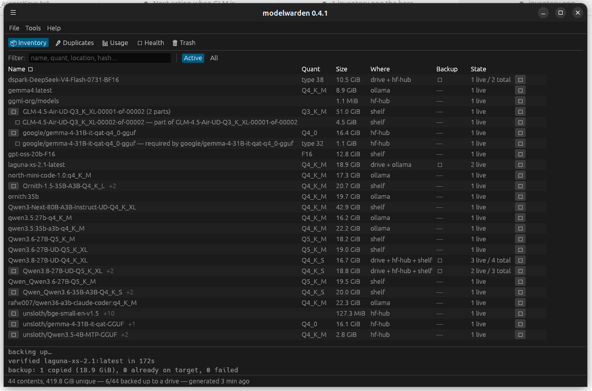

# modelwarden

[](https://github.com/unclebucklarson/model-warden/actions/workflows/ci.yml)
[](https://github.com/unclebucklarson/model-warden/releases/latest)
[](LICENSE-MIT)

> **🧪 Testers wanted!** warden is young, and every good recent feature
> came from someone actually using it and hitting something. If you run
> local models, we'd love your eyes: install, point it at your stores
> (scanning is read-only), and tell us what surprised you —
> [bug reports and QA reports](../../issues/new/choose) have ready-made
> forms. **macOS users especially**: the Mac build is in beta and
> [docs/qa-macos.md](docs/qa-macos.md) is a complete guided testing
> script. Nothing warden does in its read commands can touch your model
> files.

**Inventory, backup, and archival for local LLM model files** — GGUFs and
safetensors-style model directories alike. The owner of 200GB+ of models — scattered across Ollama's blob store, the HuggingFace hub
cache, shelf directories, NAS mounts, and removable drives — can always
answer: *what do I have, where is it, is it reachable, is it backed up, and
which of these are the same bytes?* And nothing warden does can lose bytes.



Identity is content: SHA-256, never path. A cheap `(size, mtime, dev, ino)`
fingerprint detects change; hashes are computed lazily by a background
worker (~680 MB/s measured; ~8 min for 300 GiB, then near-instant reruns).

## The two programs

- **`warden`** — the CLI. Every read command takes `--json`.
- **`warden-gui`** (`cargo run`) — a traditional desktop app: menu bar,
  status bar, activity log; Inventory / Duplicates / Usage / Health /
  Trash tabs.

## Commands

```
warden scan              live view of every store (no writes)
warden hash              update the catalog: rescan, hash new/changed
warden status            roots, identity coverage, duplicates, backup state
warden dups              hash-identical duplicates + reclaimable bytes
warden doctor [--fix]    store health, each finding explained with a remedy;
                         --fix runs the owning tool's own cleanup commands
                         (hf cache rm, ollama rm) and clears download debris
warden roots add|list    register drives/NAS by fs UUID (+ marker file)
warden where <query>     locate by name, path, or sha256 prefix — incl. offline drives
warden backup <path> [query…]  verified copy to a target drive; queries
                         select models (blank = all), each expanded to its
                         full bundle — split parts and vision projectors
                         always travel together
warden verify <path|id|--all> [--repair]
                         re-hash roots against their manifests (bit-rot
                         check); --repair re-copies bad files from a live
                         source, replacing them atomically
warden scrub install [--enable]
                         systemd user timer: hash && verify --all on a
                         schedule (weekly default); --enable also starts it
warden archive <query>   promote a cache-owned model to the shelf
warden archive demote <query> --to <root> [--remove-source]
warden restore <query>   verified copy from a drive back to the shelf
warden delete <query…>   stage 1 of deletion: move bundles to the root's
                         trash (a rename — restorable, nothing destroyed);
                         shared companions auto-kept, foreign copies get
                         the owner command printed, never run
warden trash [list|restore <q>|empty --yes]
                         inspect / undo / permanently destroy — `empty
                         --yes` is warden's only irreversible act
warden roots forget <id|label|path> --yes
                         un-register a drive that is truly gone (died,
                         reformatted) after an impact preview; removes
                         knowledge only, touches no bytes
warden journal [N|--all]   the operations journal: every write-op line,
                         persisted across sessions (plain text on disk)
warden dedup [--hardlink]  collapse same-fs duplicates (dry run by default)
warden report            disk usage by model family
warden fetch <org/repo> [pattern] [--token T]
                         download from HF: split sets and mmproj vision
                         projectors fetched together, dropped connections
                         auto-resume mid-transfer, gated repos via --token
                         [--save-token], the GUI token field, config
                         hf_token, $HF_TOKEN, or the hf CLI's saved login.
                         Wrong repo ids get did-you-mean suggestions
warden fetch <org/repo> --snapshot
                         whole-snapshot download for safetensors-style
                         repos (no GGUFs): every file lands together in
                         one shelf directory — the directory is the model
```

Write operations take a single-instance lock (`state/warden.lock`) so two
wardens can't race a backup or reclaim; stale locks from crashed runs are
detected and stolen.

## Safety model

- **Never write inside a store another tool owns** (Ollama, HF cache):
  scanned and reported; cleanup routes through the owning tool's own CLI,
  run only on explicit request — and its success is verified, never
  trusted. Two guarded exceptions warden removes itself: `*.incomplete`
  download debris and provably-empty pruned husks. Orphan blobs (real
  bytes) are always left to the human.
- **Every copy is verified**: `.partial` temp name → source-read hash must
  match the catalog → destination read back and re-hashed → rename.
- **The only reclaim is hardlinking** (same filesystem, owned roots only),
  and both sides are re-hashed against the bytes on disk first.
- **Bytes are destroyed only by `trash empty`**: deletion is two-stage —
  `delete` renames bundles into the root's trash (restorable), and only
  the explicit empty destroys them. `demote --remove-source` goes the
  same way: the shelf copy moves to the trash, and only after the cold
  copy has verified — a provably completed move that is still undoable.
- **Offline is not gone**: unplugged drives keep their manifests; the
  catalog answers "it's on the drive labeled archive1".

## For other tools

`~/.local/state/modelwarden/inventory.json` is a published, read-only,
versioned contract — see [docs/inventory-schema.md](docs/inventory-schema.md).
Drives carry their own `.modelwarden/manifest.json`, so a backup drive is
self-describing on any machine.

**New to modelwarden?** Two doors: **[the Tutorial](docs/tutorial.md)**
teaches everything hands-on in a 90-minute sandbox course (your real
models untouched — you'll even cause and repair bit rot yourself), and
the **[User's Guide](docs/users-guide.md)** is the full reference: every
concept, both programs, every command, recipes, and FAQ.

## Setting up

Grab the latest tarball from GitHub Releases — Linux x86_64, macOS
Apple Silicon and Intel — (binaries `warden` and `warden-gui`; put them
on your `PATH`), or build from source (see Building below). macOS is in
beta: see [docs/qa-macos.md](docs/qa-macos.md) for install notes
(Gatekeeper) and known limitations. Then, first run, in order:

```
warden scan                    # find your stores; check the inventory looks right
warden hash                    # compute content identity (SHA-256) — the catalog
warden scrub install --enable  # weekly background re-verify: bit-rot detection
warden doctor                  # store health; it will nag about anything missing
```

The scrub step matters more than it looks: without it nothing ever re-reads
your bytes, so silent corruption on a shelf or backup drive surfaces only
when a restore fails. `warden doctor` reminds you until the timer is
running (on systemd machines; elsewhere it stays quiet — use cron to run
`warden hash && warden verify --all` instead).

## Building

Rust, edition 2024. `cargo build` / `cargo test`; `cargo run` opens the GUI.
The hash-path crates are optimized even in dev profiles (see Cargo.toml).

Design authority: [PLAN.md](PLAN.md). Status: [ROADMAP.md](ROADMAP.md).
User documentation: [docs/users-guide.md](docs/users-guide.md).
Spike results that shaped the design: [docs/spikes.md](docs/spikes.md).
Project overview for readers outside the repo: [docs/overview.md](docs/overview.md).

## License

Licensed under either of

- Apache License, Version 2.0 ([LICENSE-APACHE](LICENSE-APACHE))
- MIT license ([LICENSE-MIT](LICENSE-MIT))

at your option. Unless you explicitly state otherwise, any contribution
intentionally submitted for inclusion in this work by you, as defined in the
Apache-2.0 license, shall be dual licensed as above, without any additional
terms or conditions.
